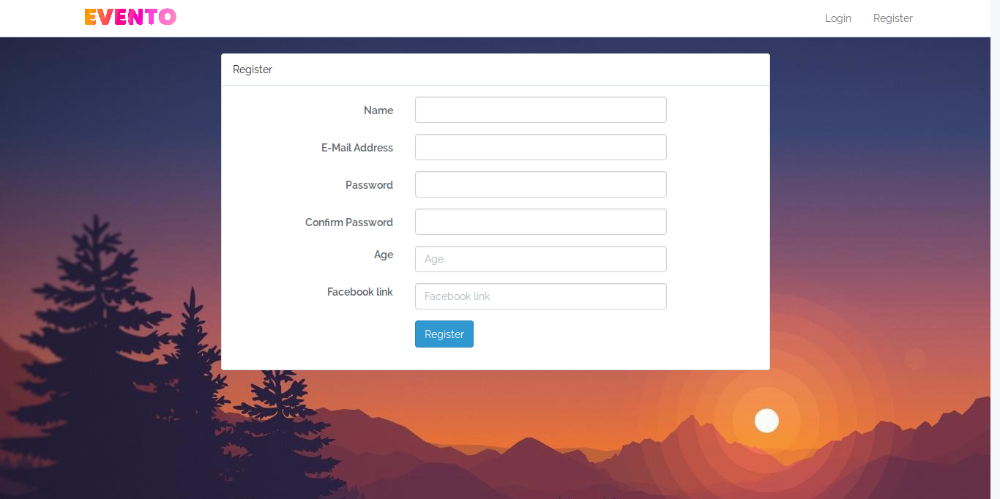

# Evento
> An event management system developed for a hackathon.

Evento is an event management system developed in laravel. Users can create events, see upcoming events, bookmark events, etc.

## Screenshots

